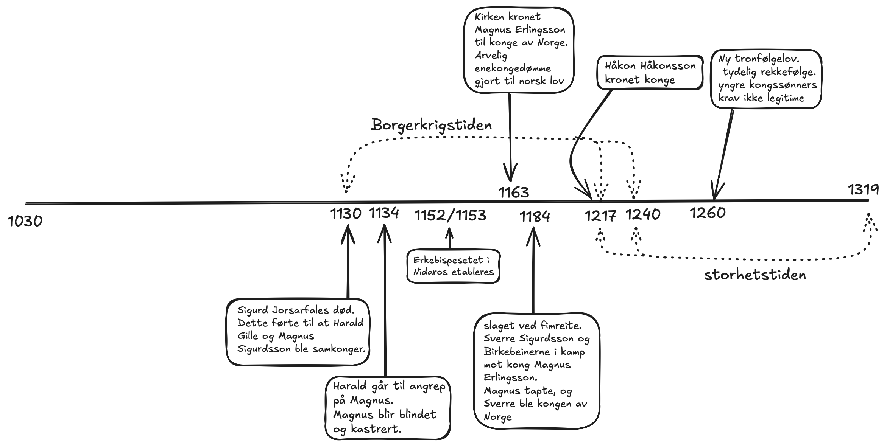

<body style="width: 80ch; margin: auto;">

### Oppgave 1: lag ei tidslinje ved hjelp av årstall og hendelser som er nevnt i teksten. forklar hvordan de ulike hendelsene og personene du har notert, henger sammen med hverandre.
- sigurd jorsafales dør, som fører til at harald gille og hans nevø magnus sigurdsson blir samkonger. de hersker relativt fredelig sammen
    frem til en stidelighet i 1134, hvor Harald går til angrep på Magnus, som ender opp med å bli blindet og kastrert. Harald blir enekonge.
    blindingen og kasterringen av magnus markerte starten på borgerkrigstiden i norge. erkebispesetet i nidaros etableres i 1152/1153.
    dette markerer at kirken får en mektigere posisjon i norge. 1163 blir magnus erlingsson den første kongen til å bli kronet av kirken,
    etter at hans far, erling skakke, brukte sin posisjon hos erkepiskesetet i nidaros til å få kirken til å krone magnus. samtidig som dette
    ble det holdt et riksmøte, hvor arvelig enekongedømme ble vedtatt som norsk lov. 1184 ved slaget i femreite dro 
    sverre sigurdsson med birkebeinerne til angrep på magnus erlignsson, hvor magnus tapte og sverre ble kronet til konge.
    1217 ble håkon håkonsson valgt til konge av birkebeinerne. samtidig som håkon ble kronet til konge, tok stridighetene gradvis slutt,
    og siste motstandt ble slått ned i 1240. dette markerte slutten på borgerkrigstiden, og starten på storhetstiden. 1260 kom ny
    tronfølgelov, som definerte en tydeligere reggefølge, hvor yngre kongssønner ikke lenger hadde legitimt krav på kronen. dermed regjerte
    etterkommerne av sverre sigurdsson frem til 1319.

### Oppgave 2: hvem hadde arverett til tronen ved starten av borgerkrigstiden?
- på starten av borgerkrigstiden var det Harald Gille og Magnus Sigurdsson som hadde arverett til tronen. når det kommer til lovverket for
    hvem som har arverett til tronen, så var det slik at alle sønner av en konge hadde lik rett på tronen, selv de sønner som er utenfor
    ekteskap.

### Oppgave 3: hva skulle til for at en kongssønn skulle bli konge?
- for at en kongssønn skulle bli konge måtte den bli valgt til konge ved seremonier hos lokale allting, hvor alle frie, våpenføre menn kunne
    møte. om det var tvil om kongssønnen virkelig var tronarving, kunne ham eller moren bære jernbyrd, hvor du gikk på glødende jern, og
    om du ikke hadde merker noen dager senere var du legiting tronarving, ettersom du var beskyttet av gud.

### Oppgave 4: hva var samkongedømme?
- samkongedømme var når to eller flere konger regjerte samtidig over det samme riket. de delte likt på inntekter og makten.

### Oppgave 5: hvorfor var ofte gruppene som sto mot hverandre, lite faste?
- gruppene som sto mot hverandre var lite faste, fordi lojalitetsbåndene mellom kongsemner og grupper var ikke arvet, og måtte bygges opp
    på nytt for hver generasjon. dette kunne føre til at nye grupper sto mot hverandre.

### Oppgave 6: hvilke rolle spilte birkebeinerne i borgerkrigstiden?
- birkebeinerne spilte en stor rolle i borgerkrigstiden, ettersom de var den største støttespilleren til for eksempel sverre sigurdsson under
    slaget ved Femreite. birkebeinerne var også den største støttespilleren til håkon håkonsson i 1217 da han ble valgt til konge.

### Oppgave 7: hvilke fordel kunne konger ha av kirken kongeideologi?
- konger kunne ha den fordelen at hvis kirken mente at kongen var valgt av gud, var det lettere for kongen å legitimere makten sin blandt
    folket, ettersom kirken hadde mye makt via ideologien sin. hvis kirken støttet deg hadde du som regel større sjanse for å vinne kongemakten

### Oppgave 8: hvilken fordel hadde kirken av et samarbeid med kongemakten?
- kirken hadde den fordelen at ved å støtte en konge til makten kunne de få økonomisk støtte, og få en sterkere maktposisjon ved at kongen
    ga kirken en større posisjon i samfunnet.

### Oppgave 9: hvilke konsekvenser fikk overgangen til arvekongedømme?
- konsekvensene ved å gå over til arvekongedømme var det at mange som tidligere hadde rett til tronen ikke lenger hadde gyldig krav, ettersom
    de enten var en uekte sønn, eller ikke var eldstefødte. dette gjorde at det var enda viktigere å få en sønn i stand til å ta over tronen,
    ettersom om du dør uten tronarving, ville ætten din miste maktposisjonen lettere. arvekongedømmet kan kanskje være en direkte årsak til
    at norge kom i personalunion med sverige i 1319.

<body/>
