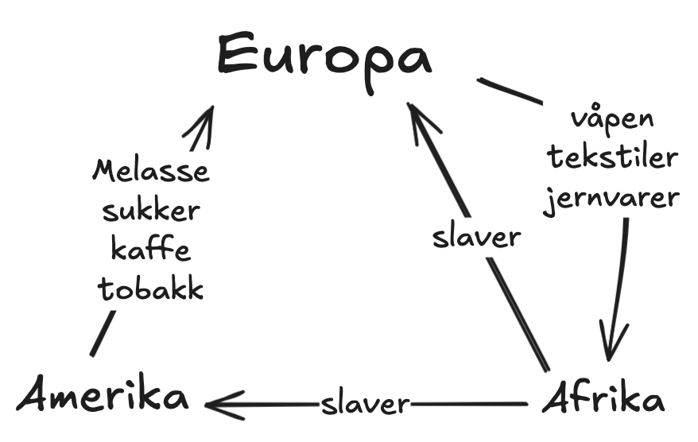

<body style="width: 80ch; margin: auto;">

### Oppgave 1: hva var årsaken til at det oppsto slavesamfunn i Amerika?
- årsaken til at det oppsto slavesamfunn i amerika var det at det ble opprettet en stor indrustri for dyrking og eksport av sukker,
    tobakk og bomull, noe som var et svært krevende arbeid, og da ble slaver billig arbeidskraft.

### Oppgave 2: hva var sukkerrevolusjonen?
- sukkerrevolusjonen var en revolusjon hvor tropiske øyer med klima passende for dyrking av sukkerstenger ble gjort om til
    sukkerplantasjer.

### Oppgave 3: hvorfor ble sukker produsert av slaver?
- sukker ble produsert av slaver fordi det var tungt og farlig arbeid hvor du ofte kune miste fingre, armer eller bein. det var
    da billigere å kjøpe nye slaver når en annen døde, enn å hyre inn europeere for arbeid.

### Oppgave 4: hvorfor krevde sukkerproduksjon tilgang til mye kapital?
- fordi du måtte kjøpe inn slaver, produksjonsutstyr og bygge fabrikkbygninger. i tillegg til dette krevde det mer kunnskap og tid
    å produsere sukker enn for eksempel tobakk, noe som gjorde det dyrt i tiden frem til du hadde ferdig produkt.

### Oppgave 5: hvilke sosiale grupper besto slavesamfunnet av?
- slavesamfunnet besto som regel av et mindretall hvite mennesker, et flertall med slaver, og etterhvert en gruppe med
    frigitte slaver.

### Oppgave 6: hvor stor betydning hadde sukker for omfanget av slavehandelen?
- det er antatt av omtrent 3/4 av de 13 millioner slavene som ble fraktet fra afrika til amerika endte i sukkerplantasjer.

### Oppgave 9: tegn opp en figur av trekanthandelen og beskriv den med egne ord.

Trekanthandelen gikk ut på at europeere hadde etablert kolonier i amerika og karibia for å produsere
    sukker, melasse, kaffe og tobakk, noe som var en ekstremt laboriøs prosess, og ikke minst farlig.
    dette gjorde at europeere satte slaver til arbeidet, ettersom de var billigere enn å hyre inn
    europeere til jobben. etterspørselen for varene amerika og karibia produserte økte, som førte til
    at eksporten av slaver fra afrika økte i takt med etterspørselen for varer. I afrika byttet
    europeere diverse tekstiler, våpen og jernvarer mot slaver.

<body />
