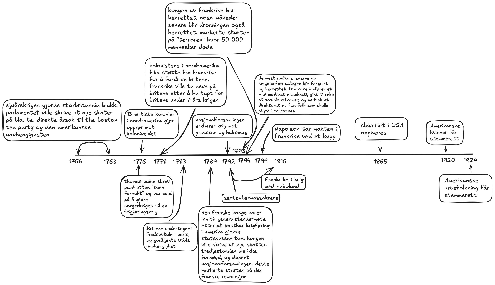

<body style="width: 80ch; margin: auto;">

### Oppgave 1: lag ei tidslinje hvor du markerer de viktigste hendelssene og personene som er nevnt i dette kapitlet.

### Oppgave 2: hvorfor gjorde de britiske kolonistene i nord amerika opprør?
- de britiske kolonistene i nord amerika gjorde opprør fordi de ikke følte de ble representert av kolonistyret, og at deres verdier
    ikke var de samme som kolonimakten. i tillegg var en utløsende årsak det at britene kom med nye skatter på for eksempel te, som
    gikk ut over de som ikke hadde mye.

### Oppgave 3: hvordan begrunnet kolonistene kravet om uavhengighet?
- de begrunnet kravet om uavhengighet ved at de mente at alle menneser er skapt like, at de er blitt skjenket visse umistelige
    rettigheter av sin skaper, og at retten til liv, frihet og streben etter lykke er blant disse. de mente at det britiske
    kolonistyret ikke ivaretok disse rettighetene, og at de derfor hadde rett til å bryte med kolonimakten.

### Oppgave 4: hvor demokratisk var idealene i uavhengighetserklæringen?
- idealene i seg selv var veldig demokratisk, i og med at de mente at en president skulle bli valgt av folket, og at makten skulle
    representere folket. det som gjorde at det ikke ble demokratisk, var det at det kun gjaldt for hvite menn med eiendom, ettersom
    det kun var dem som var regnet som myndig, og hadde stemmerett.

### Oppgave 5: på hvilken måte var eiendom knyttet til det å være myndig?
- eiendom var knyttet til det å være myndig i det at du var nødt til å kunne bidra til økonomien/samfunnet for å kunne bli regnet
    som myndig, og dermed var eiendom veldig viktig for samfunnet.

### Oppgave 6: hvordan bidro george washington til å forme rollen som amerikansk president?
- george washington nektet å gå med uniform, selv om han var leder av militæret, og han nektet å gå til gjenvalgt i neste periode i
    frykt om at det kom til å gjøre det mulig for en president å stå for livstid.

### Oppgave 7: på hvilke måter var det franske samfunnet forskjellig fra det amerikanske?
- det franske samfunnet hadde fokus på at rettighetene deres ikke kom fra gud, men at de var eksisterende fra fødsel av natur,
    ikke ved at de er gitt fra gud. det står i kontrast med de amerikanske samfunnet hvor de mente at rettighetene til mennesker
    var gitt til dem av gud, og ikke av natur.

### Oppgave 8: hvordan startet den franske revolusjonen?
- den franske revolusjonen startet ved at de var aktiv i den amerikanske revolusjonen med å støtte kolonistene i løsrivningen fra
    storbritannia. dette gjorde at frankrike var tom for penger. resultatet av dette var at kongen ville skrive ut nye skatter,
    men at disse skulle treffe adelen, og ikke bare bøndene. dette misslyktes, og tredjestanden, bøndene, brøt ut av forsamlingen
    og grunnla en nasjonalforsamling. det oppsto et voksende opprør blandt fattige bønder i paris og andre byer i frankrike, som
    førte til at bastillen ble stormet 14. juli. soldater som ble sendt til byen for å opprettholde lov og orden grep ikke inn
    under angrepet. opprøret bredte seg over hele frankrike, hvor adelsmenn ble drept og jaget med vold fra slottene sine.

### Oppgave 9: hva menes med "revolusjonen spiser sine egne barn"?
- det som menes med uttrykket er det at mange av tilhengerne av revolusjonen ble spist av de revolusjonerende, ved at de ble drept
    for at de anså seg som tilhengere av revolusjonen, men ikke var helt enig i dem som styrte.

### Oppgave 10: i hvilken grad videreførte napoleon revolusjonens idealer?
- han videreførte revolusjonens idealer i stor grad ved å føre det videre til nabonasjoner i napoleonskrigen. han kronet seg selv
    til keiser, og var ikke spesielt interessert i å bevare demokratiet, men samtidig videreførte han mange av ideene fra
    revolusjonen ved at han for eksempel hevdet at han styrte på vegne av folket, og ikke på vegne av gud. i tillegg laget han code
    civil, som sørget for at loven traff likt på alle. selv om det gjaldt kun for menn.

<body/>
